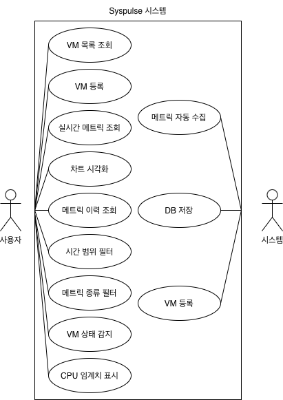
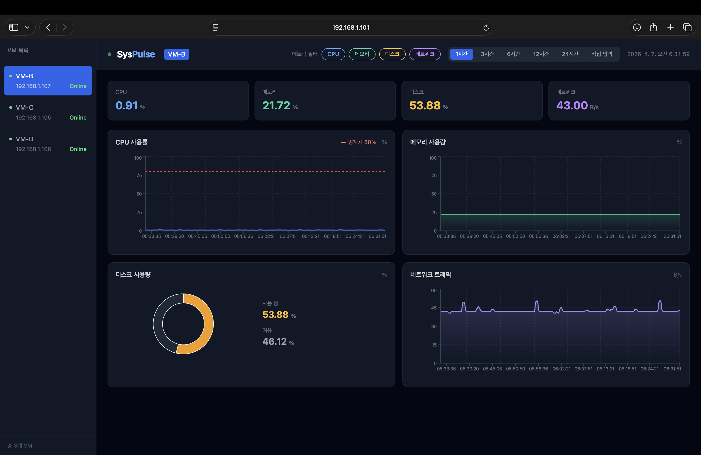
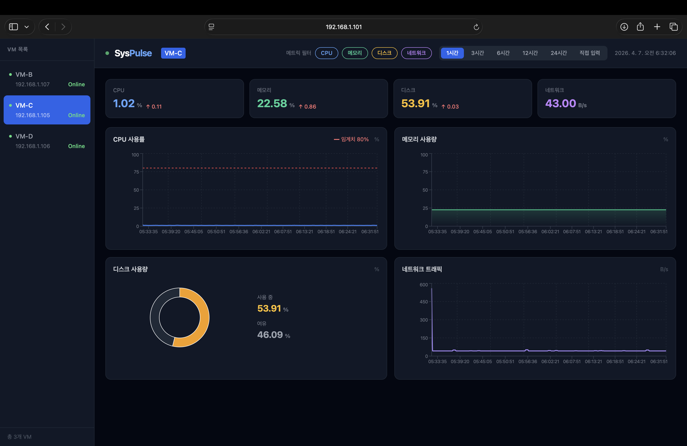
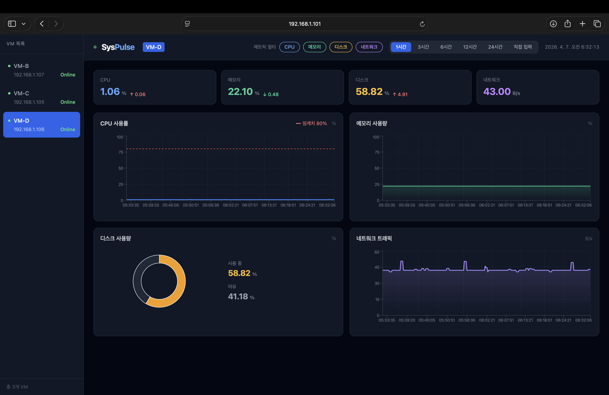
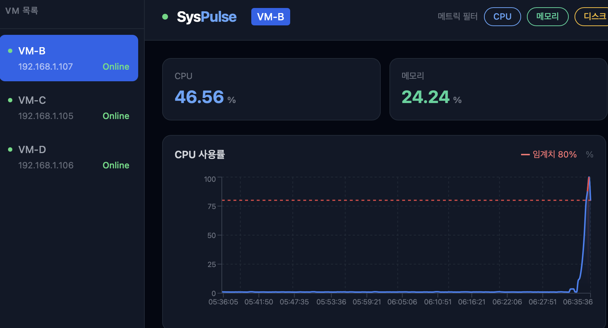
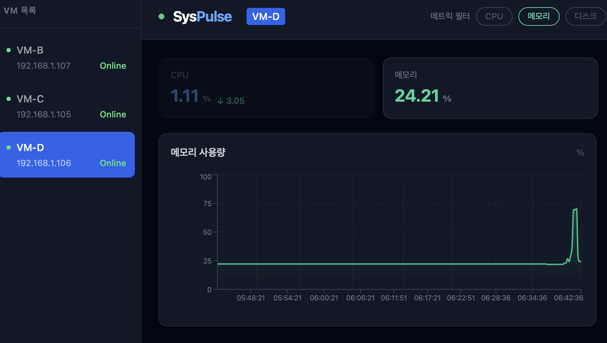
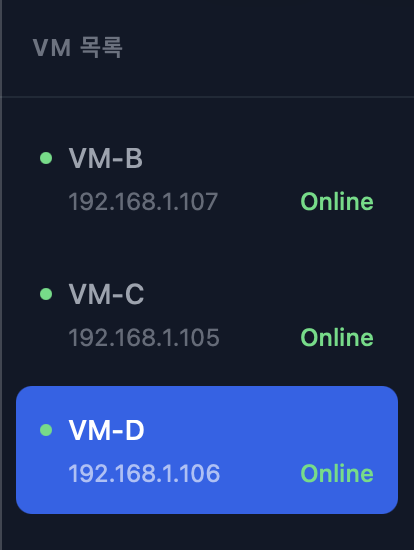
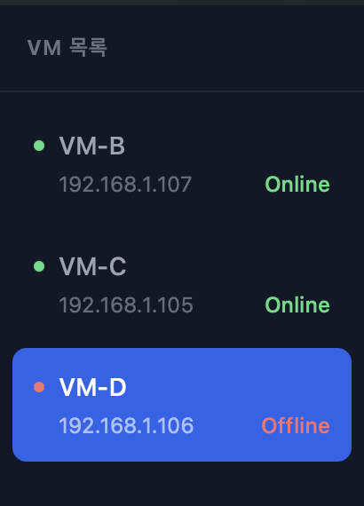

# SysPulse - 실시간 시스템 모니터링 대시보드 보고서


## 1. 실험의 목적과 범위

### 1.1 목적

본 프로젝트는 Proxmox 가상화 환경에서 운용되는 여러 가상 머신의 시스템 리소스를 실시간으로 수집 및 시각화하고, 임계치 초과 시 경보를 제공하는 웹 기반 모니터링 대시보드 **SysPulse**를 설계 및 구현하는 것을 목적으로 한다.

React, Node.js, Docker, Prometheus 등 실무에서 널리 사용되는 기술 스택을 직접 설계·구현함으로써 풀스택 웹 애플리케이션 개발 역량과 서버 인프라 운용 능력을 함양하는 것을 목표로 한다.

### 1.2 포함 내용

- Proxmox 기반 Ubuntu VM 3대(모니터링 서버 1대 + 대상 VM 3대) 구성
- Node Exporter를 이용한 VM 리소스 메트릭 수집
- Prometheus를 이용한 15초 주기 자동 수집 및 PostgreSQL 저장
- React 기반 실시간 모니터링 대시보드 구현
- PostgreSQL을 이용한 메트릭 이력 저장 및 과거 데이터 조회
- 시간 범위 필터 기능
- 메트릭 종류 필터(CPU/메모리/디스크/네트워크) 기능
- VM 온/오프라인 상태 실시간 감지
- Docker Compose를 이용한 컨테이너 기반 배포
- GitHub를 이용한 소스 코드 관리 및 버전 관리

### 1.3 불포함 내용

- HTTPS/SSL 보안 설정
- 외부 인터넷 접속 환경 (내부 네트워크 전용)

---

## 2. 분석

### 2.1 기능 목록 (유스케이스 다이어그램)




### 2.2 유스케이스 명세서

#### VM 목록 조회
 
| 항목 | 내용 |
|------|------|
| 이름 | VM 목록 조회 |
| 액터 | 사용자 |
| 시작조건 | 등록된 VM이 1개 이상 존재 |
| 기본흐름 | 1. 사용자가 대시보드 접속 → 2. React가 5초마다 `/api/vms` 호출 → 3. 백엔드가 DB에서 VM 목록 조회 → 4. 각 VM의 온라인 상태를 Prometheus `up` 메트릭으로 확인 → 5. VM 목록과 상태를 사이드바에 표시 |
| 예외흐름 | 등록된 VM이 없으면 "등록된 VM이 없습니다" 표시 |
| 종료조건 | 사이드바에 VM 목록과 Online/Offline 상태가 표시됨 |
 
#### VM 등록
 
| 항목 | 내용 |
|------|------|
| 이름 | VM 등록 |
| 액터 | 사용자 |
| 시작조건 | 대상 VM에 Node Exporter가 실행 중 |
| 기본흐름 | 1. `POST /api/vms` 호출 → 2. 백엔드가 alias, local_ip를 DB의 vm_targets 테이블에 저장 → 3. 이후 VM 목록 조회 시 등록된 VM 포함하여 반환 |
| 예외흐름 | IP 형식이 잘못된 경우 등록 실패 |
| 종료조건 | 신규 VM이 대시보드 사이드바에 표시됨 |
 
#### 실시간 메트릭 조회
 
| 항목 | 내용 |
|------|------|
| 이름 | 실시간 메트릭 조회 |
| 액터 | 사용자 |
| 시작조건 | VM이 등록되어 있고 Node Exporter가 실행 중 |
| 기본흐름 | 1. 사용자가 VM 목록에서 VM 선택 → 2. React가 5초마다 `/api/metrics/current` 호출 → 3. 백엔드가 Prometheus에 PromQL 쿼리 → 4. 결과를 가공하여 JSON 응답 → 5. 화면에 현재값 카드 업데이트 |
| 예외흐름 | VM이 오프라인인 경우 메트릭 값 0으로 표시 |
| 종료조건 | CPU/메모리/디스크/네트워크 현재값이 화면에 표시됨 |
 
#### 차트 시각화
 
| 항목 | 내용 |
|------|------|
| 이름 | 차트 시각화 |
| 액터 | 사용자 |
| 시작조건 | VM이 선택되어 있고 메트릭 이력 데이터가 존재 |
| 기본흐름 | 1. 사용자가 VM 선택 → 2. React가 DB 이력 데이터 조회 → 3. CPU/메모리는 AreaChart, 디스크는 PieChart, 네트워크는 AreaChart로 렌더링 → 4. 5초마다 자동 갱신 |
| 예외흐름 | 데이터 없으면 빈 차트 표시 |
| 종료조건 | 4종 차트가 화면에 표시되고 5초마다 자동 갱신됨 |
 
#### 메트릭 이력 조회
 
| 항목 | 내용 |
|------|------|
| 이름 | 메트릭 이력 조회 |
| 액터 | 사용자 |
| 시작조건 | metric_history 테이블에 데이터가 존재 |
| 기본흐름 | 1. 사용자가 시간 범위 선택 → 2. React가 `/api/metrics/history?vm_id=&range=` 호출 → 3. 백엔드가 PostgreSQL에서 해당 범위 데이터 조회 → 4. JSON 응답 → 5. 차트에 이력 데이터 표시 |
| 예외흐름 | 해당 시간대 데이터 없으면 빈 차트 표시 |
| 종료조건 | 선택한 시간 범위의 메트릭 이력이 차트에 표시됨 |
 
#### 시간 범위 필터
 
| 항목 | 내용 |
|------|------|
| 이름 | 시간 범위 필터 |
| 액터 | 사용자 |
| 시작조건 | VM이 선택되어 있음 |
| 기본흐름 | 1. 사용자가 1시간/3시간/6시간/12시간/24시간 버튼 클릭 또는 직접 입력 → 2. 날짜·시간 선택 → 3. "조회" 버튼 클릭 → 4. 해당 범위 데이터 조회 및 차트 갱신 |
| 예외흐름 | 시작 시간이 끝 시간보다 늦으면 경고 알림 표시 |
| 종료조건 | 지정한 시간 범위의 데이터가 차트에 표시됨 |
 
#### 메트릭 종류 필터
 
| 항목 | 내용 |
|------|------|
| 이름 | 메트릭 종류 필터 |
| 액터 | 사용자 |
| 시작조건 | VM이 선택되어 있음 |
| 기본흐름 | 1. 사용자가 헤더의 CPU/메모리/디스크/네트워크 버튼 클릭 → 2. 해당 메트릭 차트 토글(표시/숨김) → 3. 요약 카드도 동일하게 흐림 처리 |
| 예외흐름 | 모든 필터를 끄면 차트 영역이 비어있는 상태로 표시 |
| 종료조건 | 선택한 메트릭 종류의 차트만 화면에 표시됨 |
 
#### VM 상태 감지
 
| 항목 | 내용 |
|------|------|
| 이름 | VM 상태 감지 |
| 액터 | 사용자 |
| 시작조건 | VM이 등록되어 있음 |
| 기본흐름 | 1. React가 5초마다 `/api/vms` 호출 → 2. 백엔드가 Prometheus의 `up{instance="IP:9100"}` 쿼리 → 3. 값이 1이면 Online(초록), 0이면 Offline(빨강)으로 표시 |
| 예외흐름 | Prometheus 수집 지연 시 이전 상태 유지 |
| 종료조건 | 사이드바에 VM별 Online/Offline 상태가 실시간 표시됨 |
 
#### 증감 표시
 
| 항목 | 내용 |
|------|------|
| 이름 | 증감 표시 |
| 액터 | 사용자 |
| 시작조건 | 실시간 메트릭이 2회 이상 수신됨 |
| 기본흐름 | 1. React가 5초마다 메트릭 수신 → 2. 이전 값과 현재 값 비교 → 3. 증가 시 빨간색 ↑, 감소 시 초록색 ↓ 표시 → 4. 변화 없으면 표시 안 함 |
| 예외흐름 | 첫 번째 수신 시에는 이전 값이 없어 증감 표시 안 함 |
| 종료조건 | 요약 카드에 이전 값 대비 증감 수치가 표시됨 |
 
#### CPU 임계치 표시
 
| 항목 | 내용 |
|------|------|
| 이름 | CPU 임계치 표시 |
| 액터 | 사용자 |
| 시작조건 | CPU 차트가 화면에 표시되어 있음 |
| 기본흐름 | 1. CPU 사용률이 80% 이상인 구간 감지 → 2. 해당 구간을 빨간 영역(Area)으로 표시 → 3. 80% 기준선을 빨간 점선(ReferenceLine)으로 표시 |
| 예외흐름 | CPU가 80% 미만이면 기준선만 표시되고 빨간 영역은 없음 |
| 종료조건 | CPU 80% 초과 구간이 차트에 빨간 영역으로 시각화됨 |
 
#### 메트릭 수집
 
| 항목 | 내용 |
|------|------|
| 이름 | 메트릭 수집 |
| 액터 | 시스템(자동) |
| 시작조건 | 백엔드 서버가 실행 중이고 VM이 1개 이상 등록되어 있음 |
| 기본흐름 | 1. 백엔드 시작 시 수집 엔진(collector.js) 자동 실행 → 2. 15초마다 DB에서 활성 VM 목록 조회 → 3. 각 VM에 대해 Prometheus PromQL 쿼리(CPU/메모리/디스크/네트워크) → 4. 수집된 값을 metric_history 테이블에 저장 |
| 예외흐름 | Prometheus 쿼리 실패 시 해당 메트릭 값 0으로 저장 |
| 종료조건 | 15초마다 metric_history 테이블에 새 데이터가 적재됨 |
 
#### DB 저장
 
| 항목 | 내용 |
|------|------|
| 이름 | DB 저장 |
| 액터 | 시스템(자동) |
| 시작조건 | PostgreSQL이 실행 중이고 metric_history 테이블이 존재 |
| 기본흐름 | 1. collector.js가 메트릭 수집 완료 → 2. `INSERT INTO metric_history` 쿼리 실행 → 3. vm_id, cpu, memory, disk, network, collected_at 저장 |
| 예외흐름 | DB 연결 실패 시 해당 수집 주기 저장 건너뜀 |
| 종료조건 | 수집된 메트릭이 PostgreSQL에 영구 저장됨 |
 
#### VM 등록
 
| 항목 | 내용 |
|------|------|
| 이름 | VM 등록 |
| 액터 | 시스템(자동) |
| 시작조건 | .env 파일에 VM_B_IP, VM_C_IP, VM_D_IP가 설정되어 있음 |
| 기본흐름 | 1. Docker Compose 실행 시 vm-register 컨테이너 자동 시작 → 2. 백엔드 헬스체크 통과 대기 → 3. .env에서 VM IP 읽기 → 4. 이미 등록된 IP인지 확인 → 5. 미등록 VM만 `POST /api/vms` 호출하여 등록 |
| 예외흐름 | 이미 등록된 IP는 건너뜀 / IP가 없으면 등록 안 함 |
| 종료조건 | .env에 설정된 VM이 자동으로 대시보드에 등록됨 |

---

## 3. 설계

### 3.1 시스템 구조

```
Proxmox 서버
└── VM-A (모니터링 서버) 192.168.1.101
    └── Docker Compose
        ├── Nginx :80          React 빌드 파일 서빙 + API 리버스 프록시
        ├── Backend :3000      Express REST API 서버
        ├── Prometheus :9090   메트릭 수집 (15초 간격)
        └── PostgreSQL :5432   메트릭 이력 및 VM 정보 저장

        ↓ Prometheus Pull (15초)

└── VM-B (테스트 대상 1) 192.168.1.107
    └── Node Exporter :9100

└── VM-C (테스트 대상 2) 192.168.1.105
    └── Node Exporter :9100

└── VM-D (테스트 대상 3) 192.168.1.106
    └── Node Exporter :9100
```

### 3.2 데이터 흐름

```
[Node Exporter] → (15초 Pull) → [Prometheus]
                                      ↓ (PromQL)
[React 브라우저] → (REST API) → [Express 백엔드]
      ↑ 5초 폴링                       ↓
  차트 갱신                      [PostgreSQL]
                                 메트릭 이력 저장
```

### 3.3 데이터베이스 스키마

#### vm_targets (VM 목록)

| 컬럼 | 타입 | 설명 |
|------|------|------|
| id | SERIAL PK | 고유 식별자 |
| alias | VARCHAR(64) | VM 표시 이름 |
| local_ip | VARCHAR(32) | VM IP 주소 |
| enabled | BOOLEAN | 활성화 여부 |
| created_at | TIMESTAMPTZ | 등록 시각 |

#### metric_history (메트릭 이력)

| 컬럼 | 타입 | 설명 |
|------|------|------|
| id | SERIAL PK | 고유 식별자 |
| vm_id | INTEGER FK | VM 참조 |
| cpu | NUMERIC | CPU 사용률 (%) |
| memory | NUMERIC | 메모리 사용량 (%) |
| disk | NUMERIC | 디스크 사용량 (%) |
| network | NUMERIC | 네트워크 수신량 (B/s) |
| collected_at | TIMESTAMPTZ | 수집 시각 |

#### alert_rules (알림 규칙)

| 컬럼 | 타입 | 설명 |
|------|------|------|
| id | SERIAL PK | 고유 식별자 |
| vm_id | INTEGER FK | VM 참조 (NULL이면 전체) |
| metric | VARCHAR(64) | 메트릭 종류 |
| condition | VARCHAR(8) | 조건 (gt/lt) |
| threshold | NUMERIC | 임계치 값 |
| enabled | BOOLEAN | 활성화 여부 |

### 3.4 REST API 설계

| Method | 엔드포인트 | 기능 |
|--------|-----------|------|
| GET | /api/vms | VM 목록 + 온/오프라인 상태 조회 |
| POST | /api/vms | VM 등록 |
| PUT | /api/vms/:id | VM 정보 수정 |
| DELETE | /api/vms/:id | VM 등록 해제 |
| GET | /api/metrics/current?vm= | 특정 VM 현재 메트릭 조회 |
| GET | /api/metrics/history?vm_id=&range= | 시간 범위별 메트릭 이력 조회 |
| GET | /api/alerts | 알림 이력 목록 조회 |
| GET | /api/alerts/rules | 알림 규칙 목록 조회 |

### 3.5 메트릭 수집 알고리즘 (슈더 코드)
 
```
함수 collectMetrics():
    vms = DB에서 활성화된 VM 목록 조회
    
    각 vm에 대해:
        instance = vm.local_ip + ":9100"
        
        cpu = Prometheus.query("100 - avg(idle_rate) * 100")
        memory = Prometheus.query("(1 - avail/total) * 100")
        disk = Prometheus.query("avg(1 - avail/size) * 100")
        network = Prometheus.query("sum(rate(recv_bytes[1m]))")
        
        DB.insert(metric_history, vm.id, cpu, memory, disk, network)
    
    끝
 
// 15초마다 반복 실행
setInterval(collectMetrics, 15000)
```
 
### 3.6 VM 온/오프라인 감지 알고리즘 (슈더 코드)
 
```
함수 checkVmStatus(ip):
    result = Prometheus.query("up{instance=ip:9100}")
    
    만약 result가 비어있으면:
        return false (Offline)
    만약 result[0].value == "1"이면:
        return true (Online)
    그 외:
        return false (Offline)
```
 
### 3.7 VM 등록 API 알고리즘 (슈더 코드)
 
```
함수 POST /api/vms(요청):
    alias = 요청.body.alias
    local_ip = 요청.body.local_ip
 
    만약 alias가 비어있거나 local_ip가 비어있으면:
        return 오류 응답 (400 Bad Request)
 
    DB.insert(vm_targets, alias, local_ip, enabled=true)
 
    return 성공 응답 ("VM 등록 완료")
```
 
---
 
### 3.8 VM 목록 조회 API 알고리즘 (슈더 코드)
 
```
함수 GET /api/vms():
    vms = DB.query("SELECT * FROM vm_targets WHERE enabled = true")
 
    각 vm에 대해:
        status = checkVmStatus(vm.local_ip)
        vm.online = status
 
    return vms (온라인 상태 포함)
```
 
---
 
### 3.9 실시간 메트릭 조회 API 알고리즘 (슈더 코드)
 
```
함수 GET /api/metrics/current(vm_ip):
    instance = vm_ip + ":9100"
 
    cpu     = Prometheus.query("100 - avg(idle_rate) * 100")
    memory  = Prometheus.query("(1 - avail / total) * 100")
    disk    = Prometheus.query("avg(1 - avail / size) * 100")
    network = Prometheus.query("sum(rate(recv_bytes[1m]))")
 
    각 값에 대해:
        만약 값이 없으면: 0으로 설정
        그 외: 소수점 2자리로 반올림
 
    return { cpu, memory, disk, network }
```
 
---
 
### 3.10 메트릭 이력 조회 API 알고리즘 (슈더 코드)
 
```
함수 GET /api/metrics/history(vm_id, range, start, end):
 
    만약 start와 end가 존재하면:
        조건 = "collected_at >= start AND collected_at <= end"
    그 외:
        interval = range에 따라 변환
            "1h"  → "1 hour"
            "3h"  → "3 hours"
            "6h"  → "6 hours"
            "12h" → "12 hours"
            "24h" → "24 hours"
        조건 = "collected_at > now() - interval"
 
    결과 = DB.query(
        "SELECT cpu, memory, disk, network,
         to_char(collected_at AT TIME ZONE 'Asia/Seoul', 'HH24:MI:SS') as time
         FROM metric_history
         WHERE vm_id = vm_id AND 조건
         ORDER BY collected_at ASC"
    )
 
    return 결과
```
 
---
 
### 3.11 증감 표시 알고리즘 (슈더 코드)
 
```
함수 계산증감(현재값, 이전값):
    만약 이전값이 없으면:
        return null (표시 안 함)
 
    차이 = 현재값 - 이전값
 
    만약 |차이| < 0.01이면:
        return null (변화 없음)
    만약 차이 > 0이면:
        return { 방향: "↑", 값: 차이, 색상: 빨강 }
    그 외:
        return { 방향: "↓", 값: |차이|, 색상: 초록 }
 
// 5초마다 메트릭 수신 시 호출
useEffect():
    만약 현재메트릭이 존재하면:
        증감 = 계산증감(현재메트릭, 이전메트릭)
        이전메트릭 = 현재메트릭
```
 
---
 
### 3.12 CPU 임계치 감지 알고리즘 (슈더 코드)
 
```
상수 THRESHOLD = 80
 
함수 렌더CpuChart(데이터):
    각 데이터포인트에 대해:
        만약 value >= THRESHOLD이면:
            빨간영역에 포함
        그 외:
            파란영역에 포함
 
    차트에 그리기:
        파란 AreaChart (전체 데이터)
        빨간 AreaChart (THRESHOLD 초과 데이터만)
        빨간 점선 ReferenceLine (y = THRESHOLD)
```
 
---
 
### 3.13 VM 자동 등록 알고리즘 (슈더 코드)
 
```
함수 register-vms():
    .env 파일에서 VM_B_IP, VM_C_IP, VM_D_IP 읽기
 
    백엔드 헬스체크 통과할 때까지 대기:
        GET /health 반복 호출 (2초 간격)
 
    각 (alias, ip) 쌍에 대해:
        만약 ip가 비어있으면:
            건너뜀
 
        기존VM목록 = GET /api/vms
        만약 ip가 기존VM목록에 존재하면:
            "이미 등록됨" 출력 후 건너뜀
        그 외:
            POST /api/vms { alias, local_ip: ip }
            "등록 완료" 출력
```
 
---
 
### 3.14 프론트엔드 컴포넌트 구조
 
```
App
└── Dashboard (메인 페이지)
    ├── VmList (VM 목록 사이드바)
    ├── MetricFilter (메트릭 종류 필터)
    ├── TimeRangePicker (시간 범위 선택)
    │   └── DateTimePicker (날짜/시간 직접 입력)
    ├── 요약 카드 (CPU/메모리/디스크/네트워크 현재값)
    ├── CpuChart (CPU 사용률 Area 차트)
    ├── MemoryChart (메모리 사용량 Area 차트)
    ├── DiskChart (디스크 사용량 Pie 차트)
    └── NetworkChart (네트워크 트래픽 Area 차트)
```

---

## 4. 구현

### 4.1 구현 환경

#### 하드웨어 환경

| 항목 | 내용 |
|------|------|
| 서버 | Proxmox VE 기반 물리 서버 |
| 가상화 | Proxmox VE |
| VM-A (모니터링 서버) | vCPU 2코어, RAM 2GB, 디스크 20GB |
| VM-B/C/D (대상 VM) | vCPU 1코어, RAM 1GB, 디스크 10GB |
| 네트워크 | 내부 네트워크 (192.168.1.0/24) |

#### 소프트웨어 환경

| 항목 | 버전 | 역할 |
|------|------|------|
| Ubuntu | 22.04 LTS | VM 운영체제 |
| Docker | 최신 | 컨테이너 런타임 |
| Docker Compose | v1 | 멀티 컨테이너 관리 |
| Node.js | 20.x | 백엔드 런타임 |
| React | 18.x | 프론트엔드 프레임워크 |
| Vite | 8.x | 프론트엔드 빌드 도구 |

### 4.2 개발 언어 및 프레임워크

#### 프론트엔드

**React 18**을 이용해 사용자가 보는 대시보드 화면 전체를 개발했다. **Recharts 라이브러리**를 이용해 CPU, 메모리, 디스크, 네트워크 차트를 구현했고, **Tailwind CSS**를 이용해 다크 모던 스타일로 UI를 디자인했다. **Axios**를 이용해 1주차에 개발한 백엔드 REST API와 연결하여 VM 목록 및 메트릭 데이터를 화면에 표시한다.

#### 백엔드

**Node.js + Express**를 이용해 REST API 서버를 직접 개발했다. React의 요청을 받아 Prometheus에 PromQL 쿼리를 보내고 결과를 가공하여 응답한다. node-postgres(pg)를 이용해 PostgreSQL과 연결했다.

#### 모니터링 수집

**Prometheus**를 이용해 VM-B, VM-C, VM-D의 메트릭을 15초마다 자동 수집한다. 각 대상 VM에는 **Node Exporter**를 설치하여 CPU, 메모리, 디스크, 네트워크 데이터를 9100 포트로 노출시켰다.

#### 데이터베이스

**PostgreSQL 15**를 이용해 VM 목록, 메트릭 이력, 알림 규칙, 알림 이력을 저장한다. 백엔드가 15초마다 Prometheus에서 수집한 데이터를 DB에 저장하여 과거 데이터 조회가 가능하다.

### 4.4 디렉토리 구조

```
syspulse/
├── .env                      # 환경변수 (git 제외)
├── .env.example              # 환경변수 예시
├── .gitignore
├── docker-compose.yml        # 4개 서비스 정의
├── generate-config.sh        # prometheus.yml 자동 생성
├── register-vms.sh           # VM 자동 등록 스크립트
├── prometheus/
│   ├── prometheus.yml        # 자동 생성됨
│   └── prometheus.yml.template
├── frontend/
│   ├── nginx.conf
│   ├── src/
│   │   ├── components/
│   │   │   ├── charts/       # CpuChart, MemoryChart, DiskChart, NetworkChart
│   │   │   ├── filters/      # MetricFilter, TimeRangePicker
│   │   │   └── vms/          # VmList
│   │   ├── hooks/
│   │   │   ├── useMetrics.js
│   │   │   └── useVms.js
│   │   └── pages/
│   │       └── Dashboard.jsx
└── backend/
    └── src/
        ├── index.js
        ├── db.js
        ├── routes/
        │   ├── vms.js
        │   ├── metrics.js
        │   └── alerts.js
        └── services/
            └── collector.js
```

---

## 5. 실험

### 5.1 테스트 환경

| 항목 | 내용 |
|------|------|
| 모니터링 서버 | VM-A (192.168.1.101) |
| 테스트 대상 | VM-B (192.168.1.107), VM-C (192.168.1.105), VM-D (192.168.1.106) |
| 브라우저 | Safari (macOS) |
| 테스트 기간 | 2026년 3월 ~ 4월 |

### 5.2 테스트 케이스 및 결과

#### 01 실시간 메트릭 수집 테스트

| 항목 | 내용 |
|------|------|
| 목적 | Node Exporter에서 메트릭이 정상 수집되는지 확인 |
| 방법 | `curl http://192.168.1.107:9100/metrics` 실행 |
| 기대 결과 | CPU, 메모리 등 메트릭 데이터 출력 |
| 실제 결과 | 정상 출력 확인 |





#### 02 CPU 부하 테스트

| 항목 | 내용 |
|------|------|
| 목적 | CPU 부하 발생 시 대시보드에 반영되는지 확인 |
| 방법 | `stress --cpu 2 --timeout 60` 실행 |
| 기대 결과 | CPU 차트에 수치 급등 표시 |
| 실제 결과 | CPU 50% 이상 급등 후 차트에 피크 표시 확인 |



#### 03 메모리 부하 테스트

| 항목 | 내용 |
|------|------|
| 목적 | 메모리 사용량 변화가 대시보드에 반영되는지 확인 |
| 방법 | `stress --vm 1 --vm-bytes 500M --timeout 30` 실행 |
| 기대 결과 | 메모리 차트에 수치 급등 표시 |
| 실제 결과 | 메모리 사용량 증가 후 차트 반영 확인 |



#### 04 VM 온/오프라인 감지 테스트

| 항목 | 내용 |
|------|------|
| 목적 | VM 전원 종료 시 Offline으로 표시되는지 확인 |
| 방법 | VM-B 전원 종료 후 대시보드 확인 |
| 기대 결과 | VM-B가 빨간불 + Offline으로 표시 |
| 실제 결과 | 5초 이내 Offline 상태로 변경 확인 |




#### 05 시간 범위 필터 테스트

| 항목 | 내용 |
|------|------|
| 목적 | 시간 범위 변경 시 해당 범위의 데이터가 조회되는지 확인 |
| 방법 | 1시간/6시간/24시간 버튼 클릭 및 직접 입력 |
| 기대 결과 | 선택한 시간 범위의 데이터가 차트에 표시 |
| 실제 결과 | 각 범위별 데이터 정상 조회 확인 |

#### 06 과거 데이터 저장 테스트

| 항목 | 내용 |
|------|------|
| 목적 | 브라우저 새로고침 후에도 과거 데이터가 표시되는지 확인 |
| 방법 | 브라우저 강제 새로고침 후 차트 확인 |
| 기대 결과 | 새로고침 이전 데이터가 차트에 유지 |
| 실제 결과 | PostgreSQL에 저장된 이력 데이터 정상 조회 확인 |

---

## 6. 결론

### 6.1 작업 결과 요약

본 프로젝트에서는 Proxmox 가상화 환경에서 운용되는 VM들의 시스템 리소스를 실시간으로 모니터링하는 웹 기반 대시보드 **SysPulse**를 설계·구현하였다.

React 18 기반의 프론트엔드와 Node.js + Express 기반의 백엔드를 직접 개발하고, Prometheus와 Node Exporter를 활용하여 15초 주기로 메트릭을 자동 수집하는 시스템을 구축하였다. PostgreSQL을 이용해 수집된 메트릭을 영구 저장함으로써 과거 데이터 조회 기능을 구현하였다.

### 6.2 구현된 주요 기능

- VM 3대(VM-B, VM-C, VM-D)의 CPU/메모리/디스크/네트워크 실시간 모니터링
- 5초 주기 자동 갱신 차트 (AreaChart, PieChart)
- 메트릭 이력 DB 저장 및 시간 범위별 조회 (1시간~24시간, 직접 입력)
- VM 온/오프라인 상태 실시간 감지 및 표시
- 메트릭 종류별 필터링 기능
- CPU 80% 임계치 초과 시 빨간 영역 시각화
- 이전 값 대비 증감(↑↓) 표시
- Docker Compose 기반 컨테이너 배포 및 VM 자동 등록

---
